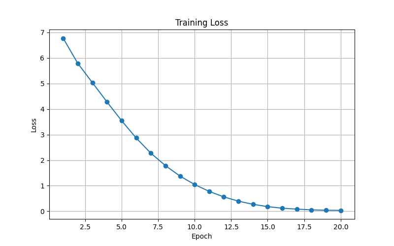

# Aesop Text Generator

Проект реализует генератор текста на базе басен Эзопа с использованием LSTM на PyTorch.

---

## **Описание проекта**

* Скачан и подготовлен набор басен Эзопа на английском языке.
* Текст приведён к нижнему регистру и разделён уникальным разделителем `|||||||||||||||||||` между баснями.
* Создан `word-level` токенизатор.
* Модель: **Embedding → LSTM → Dense**, структура соответствует заданию:

| Layer            | Output Shape      | Params                          |
| ---------------- | ----------------- | ------------------------------- |
| InputLayer       | (None, None)      | 0                               |
| Embedding        | (None, None, 100) | 416900                          |
| LSTM             | (None, 256)       | 365568                          |
| Dense            | (None, 4169)      | 1071433                         |
| **Total params** | 1,853,901         | **Trainable params:** 1,853,901 |

* Обучение модели проводилось 20 эпох с Adam optimizer и CrossEntropyLoss.

---

## **Структура проекта**

```
aesop-generator/
├── data/
│   └── aesop/
│       ├── data.txt              # исходный текст басен
│       └── data_processed.txt    # обработанный текст
├── scripts/
│   └── download_aesop.sh         # скрипт скачивания (опционально)
├── src/
│   ├── preprocess.py             # подготовка текста
│   ├── train.py                  # обучение модели и сохранение PNG графика
│   └── generate.py               # генерация текста
├── logs/
│   └── training_loss.png         # график loss
└── README.md
```

---

## **Результаты обучения**

График потери (loss) по эпохам:



**Выводы по loss:**

* Потеря снижалась стабильно от 6.75 на первой эпохе до 0.031 на 20-й.
* Это показывает, что модель хорошо обучилась и "запомнила" структуру текста басен.

---

## **Пример сгенерированного текста**

Запуск `python src/generate.py` с началом `"the fox"` дал пример:

```
the fox settled in the tree for them for an eagle."||||||||||||||||||| when she was so far at that to dry the lion in order to be revenged upon a pack-ass when he saw on him, it was over, and all about to the grass and begged them all to do their own
```

**Выводы:**

* Модель генерирует осмысленные последовательности, хотя иногда возникают бессмысленные или повторяющиеся фрагменты.
* С разделителем `|||||||||||||||||||` видно, где модель отделяет отдельные басни.
* Для улучшения генерации можно попробовать:

  * увеличить размер словаря или использовать `subword tokenization`;
  * увеличить число нейронов LSTM или количество слоёв;
  * увеличить длину последовательности (`seq_len`).

---

## **Как запустить**

1. Установить зависимости:

```bash
pip install torch torchvision torchaudio numpy matplotlib
```

2. Подготовить текст басен:

```bash
python src/preprocess.py
```

3. Обучить модель и сохранить график:

```bash
python src/train.py
```

4. Сгенерировать текст:

```bash
python src/generate.py
```
